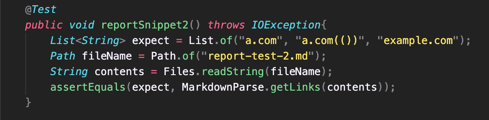
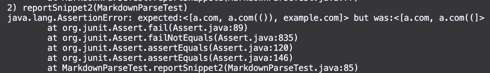
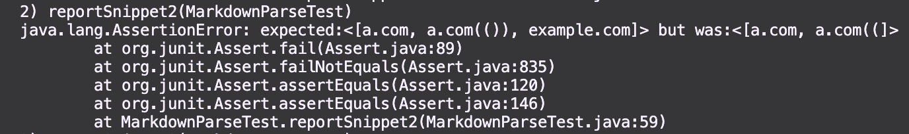
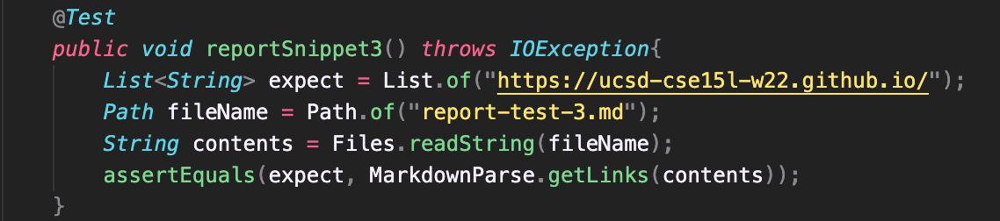
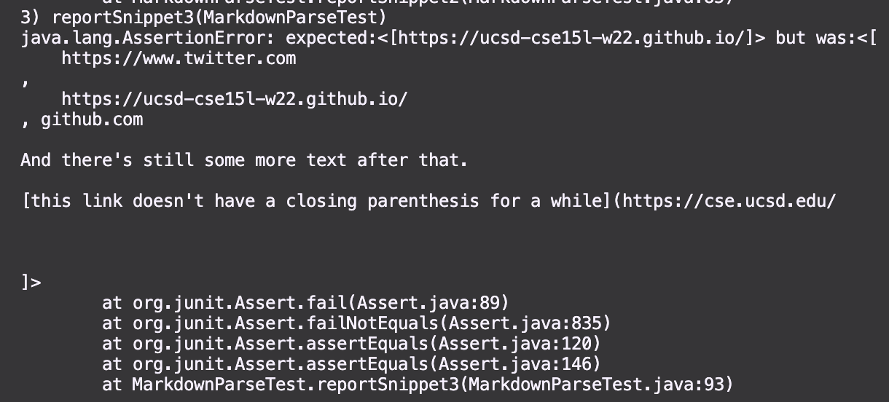
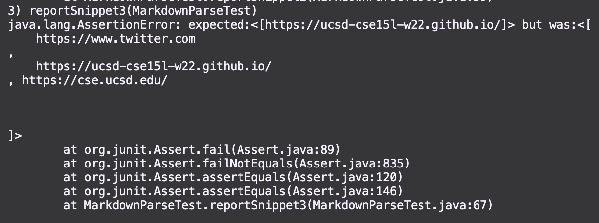

# Lab Report 4 - Week 8
**Objective:** This report will focus on highlighting how 3 tests work with the MarkdownParse of my lab group along with another lab group. 

---
## Links to Respositories
[Fiddler Crabs](https://github.com/JaredJose/markdown-parse)

[Other Group](https://github.com/christopherthomason/markdown-parse)

---
## Snippet 1
``` 
`[a link`](url.com)

[another link](`google.com)`

[`cod[e`](google.com)

[`code]`](ucsd.edu)
```
The expected output is: 
```
["'google.com", "google.com", "ucsd.edu"]
```

Test: 

Fiddler Crab JUnit Output: 

Other Group JUnit Output: 


---
## Snippet 2
```
[a [nested link](a.com)](b.com)

[a nested parenthesized url](a.com(()))

[some escaped \[ brackets \]](example.com)
```

The expected output is:
```
["a.com", "a.com(())", "example.com"]
```

Test: 

Fiddler Crab JUnit Output: 

Other Group JUnit Output: 

---
# Snippet 3
```
[this title text is really long and takes up more than 
one line

and has some line breaks](
    https://www.twitter.com
)

[this title text is really long and takes up more than 
one line](
    https://ucsd-cse15l-w22.github.io/
)


[this link doesn't have a closing parenthesis](github.com

And there's still some more text after that.

[this link doesn't have a closing parenthesis for a while](https://cse.ucsd.edu/


)

And then there's more text
```

The expected output is:
```
["https://ucsd-cse15l-w22.github.io/"]
```

Test: 

Fiddler Crab JUnit Output: 

Other Group JUnit Output: 

---

## Questions
1. I believe that it would not require a large change to adjust my group's implementation of getLinks() to help account for backticks in the link. It appears that everything within the backticks is treated as regular text, thus if we ignored all of the punctuation ([, ], (, ), etc) then our implementation should in theory be able to address this issue.
2. I believe that the change required to make the snippet2 cases of nested brackets, nested parenthesees, and escaped brackets would require a larger code change. As discussed in lecture, it could be appropriate to use a helper method and stack data structure to find the corresponding closing brackets and closing parenthesees. Although this is a very doable change, it would require a significant amount of work and testing.
3. I believe that it would not require a significant amount of changes to modify my group's implementation of getLinks() to account for the newlines throughout the links. In the case of having new lines in the displayed text, this is not allowed so all you'd have to do is continue the loop if you find a new line character between the square brackets. For the case of having a new line character in the actual link, it is only a valid link if there is a single new line character at the beginning and/or single new line character at the end. Thus, one would be able to validate that this criteria is filled in a short couple of lines. 